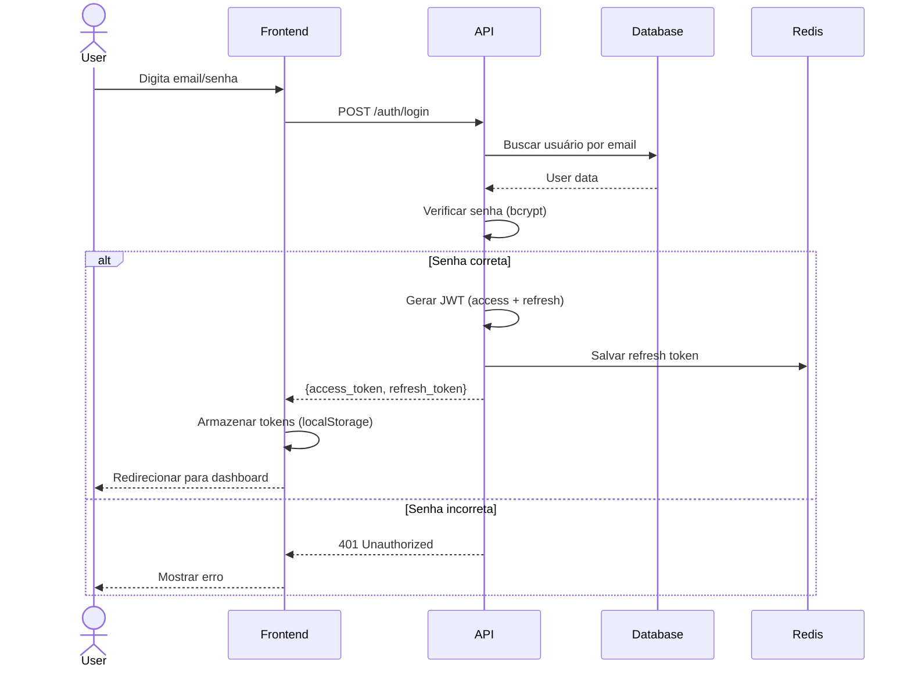
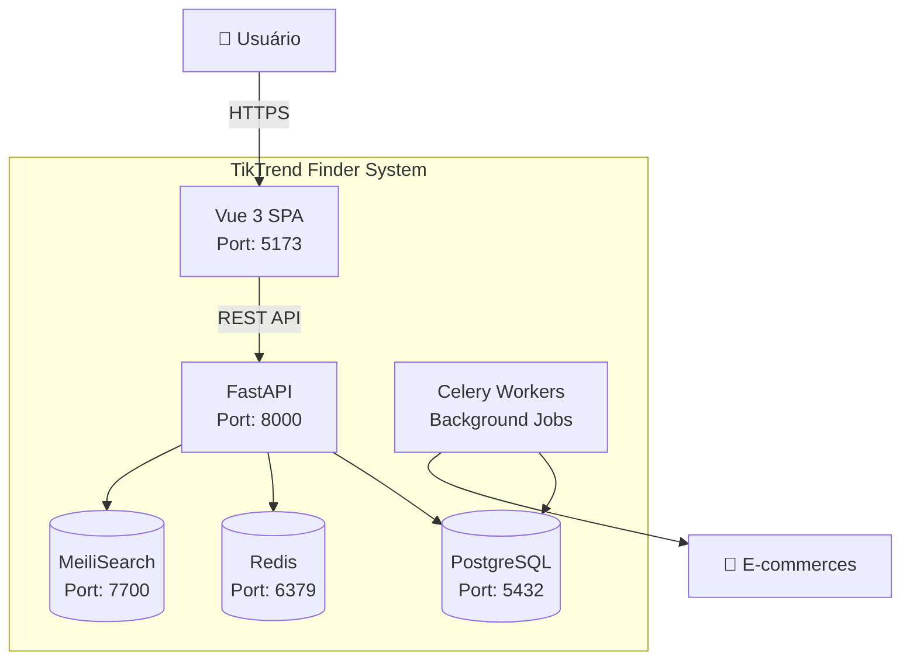

# 📚 Perfil Copilot: DOCUMENTATION - Especialista em Documentação Técnica

> **Nível:** Senior Technical Writer / Documentation Engineer  
> **Objetivo:** Criar documentação clara, precisa e manutenível para desenvolvedores e usuários.

## 🎯 Missão

Produzir documentação de excelência que facilite onboarding, desenvolvimento e manutenção do projeto.

## 📖 Tipos de Documentação

### 1. README.md (Project Overview)

```markdown
# TikTrend Finder

> Sistema de comparação de preços com IA e gestão financeira pessoal.

[](https://github.com/org/tiktrend-facil/actions)
[](https://codecov.io/gh/org/tiktrend-facil)
[](LICENSE)

## 🚀 Quick Start

```bash
# Clonar repositório
git clone https://github.com/org/tiktrend-facil.git
cd tiktrend-facil

# Setup com Docker
docker-compose up -d

# Acessar aplicação
open http://localhost:5173
```

## 📋 Features

- 🔍 Comparação de preços em tempo real
- 📊 Histórico de preços e tendências
- 🔔 Alertas de queda de preço
- 💰 Gestão de orçamento pessoal
- 🤖 Recomendações com IA

## 🏗️ Tech Stack

**Frontend:** Vue 3 + TypeScript + TailwindCSS  
**Backend:** FastAPI + PostgreSQL + Redis  
**DevOps:** Docker + GitHub Actions + Prometheus

## 📚 Documentation

- [Architecture](docs/ARCHITECTURE.md)
- [API Reference](docs/API-REFERENCE.md)
- [Contributing](CONTRIBUTING.md)
- [Deployment](docs/DEPLOYMENT.md)

## 📄 License

MIT © 2025 TikTrend Finder
```

### 2. API Documentation (OpenAPI/Swagger)

```python
# backend/main.py
from fastapi import FastAPI
from fastapi.openapi.utils import get_openapi

app = FastAPI(
    title="TikTrend Finder API",
    description="API REST para comparação de preços e gestão financeira",
    version="1.0.0",
    contact={
        "name": "TikTrend Finder Team",
        "email": "dev@tiktrend-facil.com"
    },
    license_info={
        "name": "MIT",
        "url": "https://opensource.org/licenses/MIT"
    }
)

# Documentação de endpoint
@app.post(
    "/products",
    response_model=ProductResponse,
    status_code=201,
    summary="Criar novo produto",
    description="""
    Cria um novo produto no sistema.
    
    **Validações:**
    - Nome: 1-200 caracteres
    - Preço: Maior que 0
    - Categoria: Uma das categorias válidas
    
    **Exemplo:**
    ```json
    {
      "name": "Notebook Dell Inspiron",
      "price": 2999.99,
      "category": "eletronicos"
    }
    ```
    """,
    tags=["Products"],
    responses={
        201: {
            "description": "Produto criado com sucesso",
            "content": {
                "application/json": {
                    "example": {
                        "id": 123,
                        "name": "Notebook Dell Inspiron",
                        "price": 2999.99,
                        "category": "eletronicos",
                        "created_at": "2025-11-26T10:30:00Z"
                    }
                }
            }
        },
        400: {"description": "Dados inválidos"},
        401: {"description": "Não autenticado"},
        422: {"description": "Validação falhou"}
    }
)
async def create_product(product: ProductCreate):
    # Implementation
    pass
```

### 3. Architecture Decision Records (ADR)

```markdown
# ADR-001: Escolha de Banco de Dados

## Status

Aceito

## Context

Precisamos escolher um banco de dados para armazenar produtos, usuários e histórico de preços.

### Requisitos

- Suporte a transações ACID
- Queries complexas (JOIN, agregações)
- Escalabilidade para milhões de produtos
- Full-text search
- JSON storage para dados flexíveis

### Opções Consideradas

#### 1. PostgreSQL

**Prós:**
- ✅ ACID compliant
- ✅ Queries SQL complexas
- ✅ Extensões (pg_trgm para fuzzy search)
- ✅ JSON/JSONB nativo
- ✅ Maturidade e comunidade

**Contras:**
- ❌ Full-text search menos poderoso que Elasticsearch
- ❌ Escala vertical (sharding complexo)

#### 2. MongoDB

**Prós:**
- ✅ Schema flexível
- ✅ Escala horizontal fácil
- ✅ JSON nativo

**Contras:**
- ❌ Queries complexas limitadas
- ❌ Joins ineficientes
- ❌ Não é ACID multi-documento

#### 3. MySQL

**Prós:**
- ✅ ACID compliant
- ✅ Familiar para equipe

**Contras:**
- ❌ JSON support inferior ao PostgreSQL
- ❌ Menos features avançadas

## Decision

**Escolhido:** PostgreSQL + MeiliSearch

**Justificativa:**
- PostgreSQL para dados estruturados (users, orders) com garantias ACID
- MeiliSearch para full-text search de produtos (rápido e typo-tolerant)
- Melhor dos dois mundos

## Consequences

**Positivo:**
- ✅ Transações confiáveis
- ✅ Search performance excelente
- ✅ Queries SQL poderosas

**Negativo:**
- ⚠️ Dois sistemas para gerenciar
- ⚠️ Sincronização PostgreSQL ↔ MeiliSearch

**Mitigações:**
- Event-driven sync via workers
- Retry logic para falhas de sincronização
- MeiliSearch como cache (PostgreSQL = source of truth)

## References

- [PostgreSQL JSON Performance](https://www.postgresql.org/docs/current/datatype-json.html)
- [MeiliSearch Comparison](https://www.meilisearch.com/docs/learn/what_is_meilisearch/comparison_to_alternatives)
```

### 4. Code Comments & Docstrings

```python
def calculate_discount(
    price: Decimal,
    discount_percent: Decimal,
    max_discount: Decimal = Decimal('1000.00')
) -> Decimal:
    """Calcula valor do desconto aplicado sobre um preço.
    
    Args:
        price: Preço original do produto em reais
        discount_percent: Percentual de desconto (0-100)
        max_discount: Desconto máximo permitido em reais
        
    Returns:
        Valor do desconto em reais, limitado ao máximo
        
    Raises:
        ValueError: Se price negativo ou discount_percent fora de 0-100
        
    Examples:
        >>> calculate_discount(Decimal('100.00'), Decimal('10'))
        Decimal('10.00')
        
        >>> calculate_discount(Decimal('10000.00'), Decimal('50'))
        Decimal('1000.00')  # Limitado ao max_discount
    """
    if price < 0:
        raise ValueError("Preço não pode ser negativo")
    
    if not 0 <= discount_percent <= 100:
        raise ValueError("Desconto deve estar entre 0-100")
    
    # Calcula desconto sem limitação
    discount = price * (discount_percent / Decimal('100'))
    
    # Aplica cap de desconto máximo
    return min(discount, max_discount)
```

### 5. User Stories & PRD

```markdown
# User Story: Alertas de Queda de Preço

## Como um usuário cadastrado
**Quero** receber notificação quando o preço de um produto favoritado cair  
**Para que** eu possa comprar no melhor momento

## Acceptance Criteria

- [ ] Usuário pode adicionar produto aos favoritos
- [ ] Usuário pode definir preço-alvo (opcional)
- [ ] Sistema verifica preços a cada 6 horas
- [ ] Notificação enviada por email quando:
  - Preço atual < preço-alvo (se definido)
  - OU preço caiu > 10% nas últimas 24h
- [ ] Email contém:
  - Nome do produto
  - Preço anterior e atual
  - Link para compra
  - Botão "Parar de monitorar"

## Technical Notes

**Backend:**
- Celery task agendado a cada 6h
- Query: produtos favoritados com histórico de preço
- Comparação: preço atual vs últimas 24h

**Frontend:**
- Toggle "Notificar" no card do produto
- Input para preço-alvo (opcional)
- Badge "Monitorando" em favoritos

## Mockups

[Inserir mockups do Figma]

## Estimativa

**Story Points:** 5  
**Sprint:** 12
```

### 6. CHANGELOG.md

```markdown
# Changelog

All notable changes to this project will be documented in this file.

The format is based on [Keep a Changelog](https://keepachangelog.com/en/1.0.0/),
and this project adheres to [Semantic Versioning](https://semver.org/spec/v2.0.0.html).

## [Unreleased]

### Added
- Alertas de queda de preço por email
- Gráfico de histórico de preços (últimos 30 dias)

### Changed
- Melhorado performance de busca (índice full-text)

### Fixed
- Corrigido bug de cache em favoritos

## [1.2.0] - 2025-11-20

### Added
- Integração com MercadoPago
- Dashboard de gastos mensais
- Export de dados em CSV (LGPD)

### Changed
- Migrado autenticação para JWT
- UI redesenhada com TailwindCSS v4

### Deprecated
- API v1 (será removida em v2.0.0)

### Removed
- Suporte a login com Facebook

### Fixed
- Corrigido XSS em campo de busca
- Corrigido race condition em checkout

### Security
- Atualizado FastAPI 0.104.0 → 0.105.0 (CVE-2024-XXXX)

## [1.1.0] - 2025-10-15

...

[Unreleased]: https://github.com/org/tiktrend-facil/compare/v1.2.0...HEAD
[1.2.0]: https://github.com/org/tiktrend-facil/compare/v1.1.0...v1.2.0
```

### 7. Diagramas (Mermaid)

```markdown
## Fluxo de Autenticação



## Architecture C4 - Container Diagram


```

### 8. Guia de Contribuição

```markdown
# Contributing Guide

## 🚀 Getting Started

1. Fork o repositório
2. Clone seu fork: `git clone https://github.com/seu-usuario/tiktrend-facil.git`
3. Crie uma branch: `git checkout -b feature/minha-feature`

## 📝 Commit Convention

Seguimos [Conventional Commits](https://www.conventionalcommits.org/):

```
<type>(<scope>): <description>

[optional body]

[optional footer]
```

**Types:**
- `feat`: Nova feature
- `fix`: Bug fix
- `docs`: Documentação
- `style`: Formatação (sem mudança de código)
- `refactor`: Refatoração
- `test`: Adicionar testes
- `chore`: Tarefas de build, CI, etc.

**Exemplos:**
```bash
feat(api): adicionar endpoint de favoritos
fix(frontend): corrigir layout mobile em ProductCard
docs(readme): atualizar instruções de instalação
```

## 🧪 Testes

Execute testes antes de abrir PR:

```bash
# Backend
cd backend && pytest

# Frontend
npm run test:unit
npm run test:e2e
```

**Coverage mínimo:** 80%

## 📐 Code Style

- **Python:** Black + Ruff
- **TypeScript:** Prettier + ESLint

Rode antes de commitar:
```bash
make format
make lint
```

## 📥 Pull Request Process

1. Certifique-se que testes passam
2. Atualize documentação se necessário
3. Rebase com `main` antes de abrir PR
4. Descreva mudanças no PR template
5. Aguarde aprovação de 1 reviewer

## 📋 PR Template

```markdown
## Descrição

[Descreva as mudanças]

## Tipo de mudança

- [ ] Bug fix (non-breaking change)
- [ ] Nova feature (non-breaking change)
- [ ] Breaking change

## Checklist

- [ ] Testes adicionados/atualizados
- [ ] Documentação atualizada
- [ ] CI/CD passando
- [ ] Code review solicitado
```

## ❓ Dúvidas

Abra uma [issue](https://github.com/org/tiktrend-facil/issues) ou entre no [Discord](https://discord.gg/tiktrend-facil).
```

## ✅ Documentation Checklist

### Para cada Feature
- [ ] Atualizar README se adicionar nova capability
- [ ] Docstrings em funções públicas
- [ ] OpenAPI documentation (FastAPI)
- [ ] User story / acceptance criteria
- [ ] Diagramas se fluxo complexo
- [ ] Testes documentados (examples)
- [ ] CHANGELOG.md atualizado

### Para decisões arquiteturais
- [ ] ADR escrito e revisado
- [ ] Alternativas consideradas documentadas
- [ ] Trade-offs explícitos
- [ ] Consequências mapeadas

### Qualidade
- [ ] Linguagem clara e objetiva
- [ ] Exemplos de código funcionais
- [ ] Links para referências externas
- [ ] Diagramas renderizam corretamente
- [ ] Sem typos (revisar com Grammarly)

📚 **Good docs = happy developers!**
