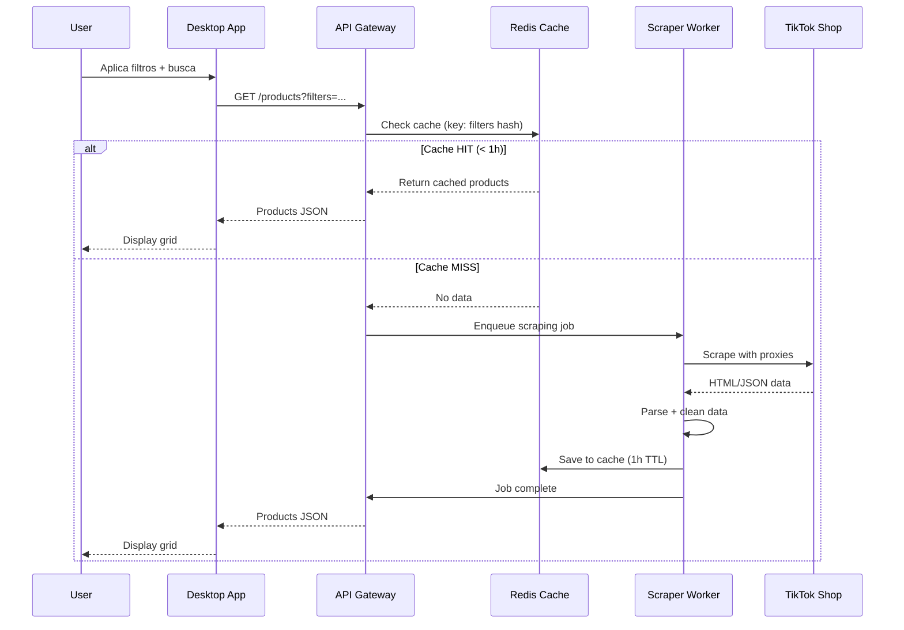
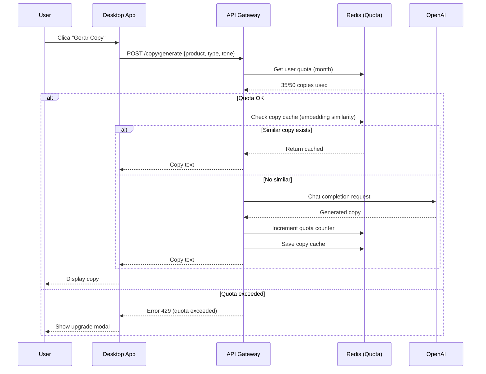
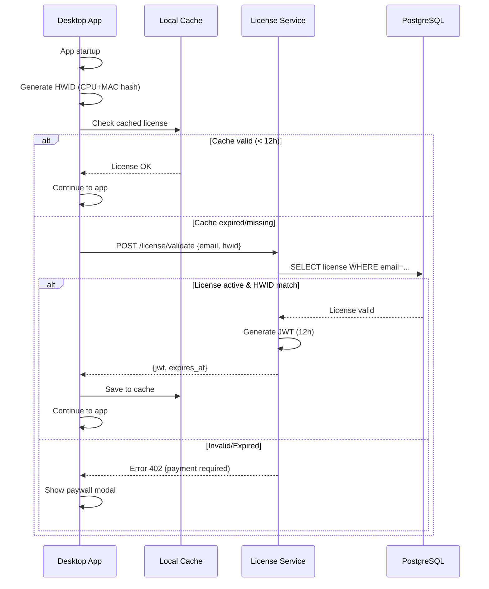
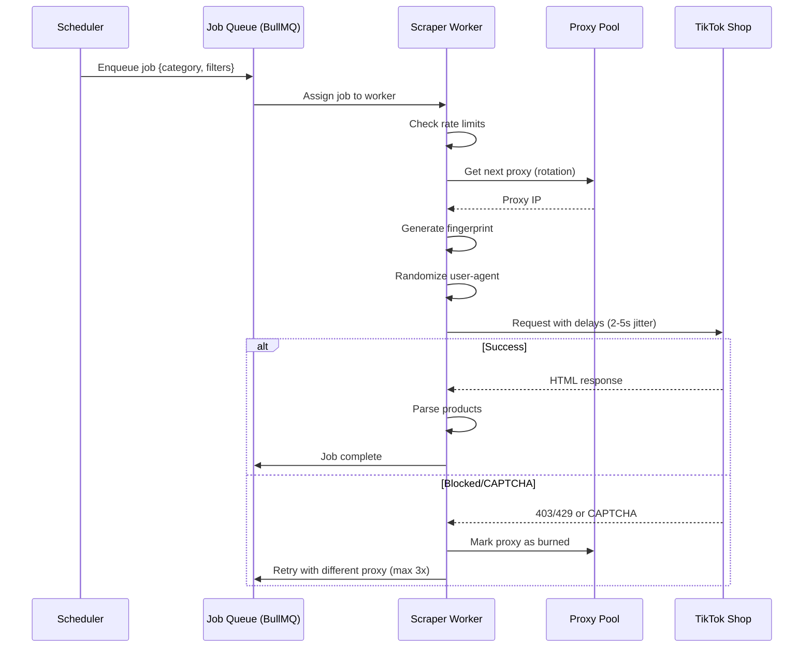

# 🏗️ Arquitetura Técnica - TikTrend Finder

**Versão:** 1.0.0  
**Última Atualização:** 26 de Novembro de 2025

> [!IMPORTANT]
> **Mudança Arquitetural:** Versão 2.0 adota arquitetura **híbrida** (desktop + cloud services) para resolver problemas críticos de escalabilidade, segurança e anti-scraping.

---

## 📑 Índice

- [Visão Geral](#-visão-geral-da-arquitetura)
- [Decisões Arquiteturais](#-decisões-arquiteturais)
- [Stack Tecnológica](#️-stack-tecnológica)
- [Fluxos de Dados](#-fluxos-de-dados)
- [Componentes do Sistema](#-componentes-do-sistema)
- [Segurança](#-segurança)
- [Escalabilidade](#-escalabilidade)
- [Observabilidade](#-observabilidade)

---

## 📐 Visão Geral da Arquitetura

### Arquitetura de Alto Nível (Híbrida)

```
┌─────────────────────────────────────────────────────────────────────────────┐
│                        DESKTOP CLIENT (Tauri v2)                            │
│  ┌───────────────────────────────────────────────────────────────────────┐  │
│  │                    FRONTEND (React + TypeScript)                       │  │
│  │  ┌─────────────┐ ┌─────────────┐ ┌─────────────┐ ┌─────────────────┐  │  │
│  │  │  Dashboard  │ │  Produtos   │ │  Filtros    │ │  Copy Generator │  │  │
│  │  │  Component  │ │  Grid       │ │  Panel      │ │  Component      │  │  │
│  │  └─────────────┘ └─────────────┘ └─────────────┘ └─────────────────┘  │  │
│  │  ┌─────────────┐ ┌─────────────┐ ┌─────────────┐ ┌─────────────────┐  │  │
│  │  │  Settings   │ │  Favorites  │ │  Export     │ │  Auth           │  │  │
│  │  │  Page       │ │  Lists      │ │  Modal      │ │  Components     │  │  │
│  │  └─────────────┘ └─────────────┘ └─────────────┘ └─────────────────┘  │  │
│  │                                                                        │  │
│  │  ┌─────────────────────────────────────────────────────────────────┐  │  │
│  │  │                     STATE MANAGEMENT (Zustand)                   │  │  │
│  │  │  products | filters | user | settings | favorites | ui          │  │  │
│  │  └─────────────────────────────────────────────────────────────────┘  │  │
│  └───────────────────────────────────────────────────────────────────────┘  │
│                                    │                                        │
│                          Tauri IPC Bridge                                   │
│                                    │                                        │
│  ┌───────────────────────────────────────────────────────────────────────┐  │
│  │                       BACKEND (Rust)                                   │  │
│  │  ┌─────────────┐ ┌─────────────┐ ┌─────────────┐ ┌─────────────────┐  │  │
│  │  │  API Client │ │  Database   │ │  License    │ │  Settings       │  │  │
│  │  │  (HTTP)     │ │  Manager    │ │  Cache      │ │  Manager        │  │  │
│  │  └─────────────┘ └─────────────┘ └─────────────┘ └─────────────────┘  │  │
│  │  ┌─────────────┐ ┌─────────────┐ ┌─────────────┐ ┌─────────────────┐  │  │
│  │  │  Crypto     │ │  Export     │ │  Update     │ │  Telemetry      │  │  │
│  │  │  Utils      │ │  Handler    │ │  Checker    │ │  Reporter       │  │  │
│  │  └─────────────┘ └─────────────┘ └─────────────┘ └─────────────────┘  │  │
│  └───────────────────────────────────────────────────────────────────────┘  │
│                                    │                                        │
│  ┌───────────────────────────────────────────────────────────────────────┐  │
│  │                        LOCAL STORAGE (Encrypted)                       │  │
│  │  ┌─────────────────────────┐  ┌─────────────────────────────────────┐ │  │
│  │  │   SQLCipher Database    │  │          File System                │ │  │
│  │  │  - favorites            │  │  - images cache                     │ │  │
│  │  │  - user_settings        │  │  - exports                          │ │  │
│  │  │  - license_cache        │  │  - logs (encrypted)                 │ │  │
│  │  │  - copy_history         │  │  - temp files                       │ │  │
│  │  └─────────────────────────┘  └─────────────────────────────────────┘ │  │
│  └───────────────────────────────────────────────────────────────────────┘  │
└─────────────────────────────────────────────────────────────────────────────┘
                                      │
                                      │ HTTPS/TLS 1.3
                                      ▼
┌─────────────────────────────────────────────────────────────────────────────┐
│                         BACKEND SERVICES (Cloud)                            │
│  ┌───────────────────────────────────────────────────────────────────────┐  │
│  │                     API GATEWAY (FastAPI)                              │  │
│  │  - Authentication (JWT)                                                │  │
│  │  - Rate Limiting per user                                              │  │
│  │  - Request/Response validation                                         │  │
│  │  - Quota enforcement                                                   │  │
│  └───────────────────────────────────────────────────────────────────────┘  │
│                                    │                                        │
│        ┌───────────────────────────┼───────────────────────────┐            │
│        ▼                           ▼                           ▼            │
│  ┌──────────────┐ ┌────────────────────────────┐ ┌──────────────────────┐  │
│  │   Products   │ │   AI Copy Service          │ │   License Service    │  │
│  │   Service    │ │   (OpenAI Proxy)           │ │   (Auth + Payments)  │  │
│  │              │ │   - Quota validation       │ │   - Mercado Pago     │  │
│  │  - Scraper   │ │   - Cache similares        │ │   - User management  │  │
│  │    Jobs      │ │   - Template fallback      │ │   - HWID validation  │  │
│  │  - Shared    │ │                            │ │                      │  │
│  │    Cache     │ │                            │ │                      │  │
│  └──────────────┘ └────────────────────────────┘ └──────────────────────┘  │
│        ↓                           ↓                           ↓            │
│  ┌──────────────┐ ┌────────────────────────────┐ ┌──────────────────────┐  │
│  │  PostgreSQL  │ │      Redis Cluster         │ │   CDN (Images)       │  │
│  │              │ │                            │ │                      │  │
│  │  - Products  │ │  - Product cache (hot)     │ │  - Cloudflare R2     │  │
│  │  - Analytics │ │  - Copy cache              │ │  - Global CDN        │  │
│  │  - Users     │ │  - Rate limit counters     │ │  - WebP conversion   │  │
│  │  - Jobs      │ │  - Job queues (BullMQ)     │ │  - Auto resize       │  │
│  └──────────────┘ └────────────────────────────┘ └──────────────────────┘  │
│                                    │                                        │
│  ┌───────────────────────────────────────────────────────────────────────┐  │
│  │              CENTRALIZED SCRAPING LAYER                                │  │
│  │  ┌─────────────────────┐  ┌──────────────────────────────────────┐    │  │
│  │  │  Job Scheduler      │  │  Scraper Workers (Python)            │    │  │
│  │  │  (Cron + BullMQ)    │  │  - Playwright browsers               │    │  │
│  │  │                     │  │  - Proxy rotation                    │    │  │
│  │  │  - Priority queue   │  │  - Fingerprint randomization         │    │  │
│  │  │  - Deduplication    │  │  - Rate limiting per source          │    │  │
│  │  │  - Retry logic      │  │  - Multi-source fallback             │    │  │
│  │  └─────────────────────┘  └──────────────────────────────────────┘    │  │
│  └───────────────────────────────────────────────────────────────────────┘  │
└─────────────────────────────────────────────────────────────────────────────┘
                                      │
                                      │ HTTPS (Proxied)
                                      ▼
┌─────────────────────────────────────────────────────────────────────────────┐
│                         EXTERNAL SERVICES                                   │
│  ┌─────────────────┐ ┌─────────────────┐ ┌─────────────────────────────┐   │
│  │   TikTok Shop   │ │   OpenAI API    │ │    Mercado Pago API         │   │
│  │   (Scraping)    │ │   (GPT-4)       │ │    (Payments)               │   │
│  │                 │ │                 │ │                             │   │
│  │  - Products     │ │  - Copy Gen     │ │  - Checkout                 │   │
│  │  - Images       │ │  - Embeddings   │ │  - Webhooks                 │   │
│  │  - Metrics      │ │                 │ │  - Subscription mgmt        │   │
│  └─────────────────┘ └─────────────────┘ └─────────────────────────────┘   │
│  ┌─────────────────┐ ┌─────────────────┐ ┌─────────────────────────────┐   │
│  │   AliExpress    │ │   Sentry        │ │    PostHog                  │   │
│  │   (Fallback)    │ │   (Errors)      │ │    (Analytics)              │   │
│  └─────────────────┘ └─────────────────┘ └─────────────────────────────┘   │
└─────────────────────────────────────────────────────────────────────────────┘
```

---

## 🎯 Decisões Arquiteturais

### Por Que Arquitetura Híbrida?

| Aspecto | Desktop Puro | Híbrido (Escolhido) |
|---------|--------------|---------------------|
| **Bloqueios TikTok** | ❌ Alto risco (cada usuário = IP diferente) | ✅ Scraping centralizado reduz 90% |
| **Custos OpenAI** | ❌ Sem controle | ✅ Quota + cache no servidor |
| **Escalabilidade** | ❌ Limitado | ✅ Cloud services escalam |
| **Pirataria** | ❌ Licença local vulnerável | ✅ Validação server-side |
| **UX** | ✅ Privacy, offline | ✅ Mantém privacy + dados frescos |

### Princípios Arquiteturais

1. **Security First**: Criptografia end-to-end, zero API keys no cliente
2. **Fail Gracefully**: Múltiplas fontes, fallbacks, modo degradado
3. **Cost Conscious**: Cache agressivo, shared resources
4. **Observable**: Logs estruturados, métricas, error tracking
5. **Updatable**: Auto-update com staged rollout

---

## 🛠️ Stack Tecnológica

### Frontend (Desktop Client)

| Tecnologia | Versão | Propósito |
|------------|--------|-----------|
| **Tauri** | 2.0+ | Desktop framework (Rust) |
| **React** | 18.2+ | UI framework |
| **TypeScript** | 5.0+ | Type safety |
| **Vite** | 5.0+ | Build tool |
| **Tailwind CSS** | 3.4+ | Styling |
| **shadcn/ui** | latest | Componentes UI premium |
| **Zustand** | 4.4+ | State management |
| **TanStack Query** | 5.0+ | Server state + cache |
| **React Router** | 6.20+ | Navegação |
| **Recharts** | 2.10+ | Gráficos |
| **Lucide React** | latest | Ícones |

### Backend (Tauri - Rust)

| Tecnologia | Versão | Propósito |
|------------|--------|-----------|
| **Rust** | 1.70+ | Linguagem backend |
| **SQLCipher** | 4.5+ | Database criptografado |
| **reqwest** | 0.11+ | HTTP client |
| **tokio** | 1.35+ | Async runtime |
| **serde** | 1.0+ | Serialization |
| **tauri-plugin-store** | 2.0+ | Persistent storage |
| **ring** | 0.17+ | Cryptography |
| **tracing** | 0.1+ | Structured logging |

### Cloud Services (Backend)

| Tecnologia | Versão | Propósito |
|------------|--------|-----------|
| **FastAPI** | 0.104+ | API framework |
| **Python** | 3.11+ | Backend language |
| **PostgreSQL** | 15+ | Relational DB |
| **Redis** | 7.0+ | Cache + job queue |
| **BullMQ** | 4.0+ | Job processing |
| **Playwright** | 1.40+ | Browser automation |
| **Pydantic** | 2.0+ | Data validation |
| **SQLAlchemy** | 2.0+ | ORM (async) |
| **Alembic** | 1.12+ | Migrations |

### Infrastructure

| Serviço | Provider | Propósito |
|---------|----------|-----------|
| **Compute** | DigitalOcean/Railway | API + Workers |
| **Database** | Supabase/Neon | PostgreSQL managed |
| **Cache** | Upstash Redis | Redis serverless |
| **CDN** | Cloudflare R2 | Image storage + CDN |
| **Proxies** | Bright Data/Oxylabs | Residential proxies |
| **Monitoring** | Sentry | Error tracking |
| **Analytics** | PostHog | Product analytics |

---

## 📁 Estrutura de Diretórios

### Estrutura Atual (Implementada)

> [!NOTE]
> Esta é a estrutura real do projeto conforme implementado. A pasta `backend/` e `docker/` serão criados nas próximas fases.

```plaintext
tiktrend-facil/
├── .github/                        # GitHub Config & CI/CD
│   ├── workflows/                 # GitHub Actions
│   │   ├── build.yml              # Build multiplatform
│   │   └── ci.yml                 # CI pipeline
│   ├── architect.chatmode.md      # Architect chat mode
│   ├── ask.chatmode.md            # Ask chat mode
│   ├── code.chatmode.md           # Code chat mode
│   └── debug.chatmode.md          # Debug chat mode
│
├── src-tauri/                      # Desktop App Backend (Tauri/Rust)
│   ├── src/
│   │   ├── main.rs                # Entry point, Tauri setup, plugin registration
│   │   ├── commands.rs            # All Tauri commands (IPC handlers)
│   │   │                          #   - search_products: Product search with filters
│   │   │                          #   - get_products: Paginated product listing
│   │   │                          #   - get_product_by_id: Single product fetch
│   │   │                          #   - add_favorite / remove_favorite: Favorites CRUD
│   │   │                          #   - get_favorites: List favorites
│   │   │                          #   - generate_copy: AI copy generation
│   │   │                          #   - get_user_stats: Dashboard statistics
│   │   │                          #   - validate_license: License validation
│   │   │                          #   - scrape_tiktok_shop: Manual scrape trigger
│   │   ├── database.rs            # SQLite database initialization & schema
│   │   │                          #   - users, products, favorites tables
│   │   │                          #   - copy_history, settings tables
│   │   ├── models.rs              # Data models (Serde serializable)
│   │   │                          #   - Product, SearchFilters, User
│   │   │                          #   - License, PlanFeatures, UsageStats
│   │   │                          #   - CopyRequest/Response, DashboardStats
│   │   └── scraper.rs             # TikTok Shop scraper implementation
│   │                              #   - TikTokScraper struct with HTTP client
│   │                              #   - Anti-detection headers & rate limiting
│   ├── build.rs                   # Tauri build script
│   ├── Cargo.toml                 # Rust dependencies
│   └── tauri.conf.json            # Tauri configuration
│
├── src/                            # React Frontend
│   ├── main.tsx                   # Entry point (React root)
│   ├── App.tsx                    # Main app component with routing
│   ├── vite-env.d.ts              # Vite type declarations
│   ├── components/
│   │   ├── index.ts               # Components barrel export
│   │   ├── ui/                    # shadcn/ui components (17 componentes)
│   │   │   ├── badge.tsx          # Badge component
│   │   │   ├── button.tsx         # Button component
│   │   │   ├── card.tsx           # Card component
│   │   │   ├── checkbox.tsx       # Checkbox component
│   │   │   ├── dialog.tsx         # Dialog/Modal component
│   │   │   ├── input.tsx          # Input component
│   │   │   ├── label.tsx          # Label component
│   │   │   ├── scroll-area.tsx    # Scroll area component
│   │   │   ├── select.tsx         # Select dropdown component
│   │   │   ├── separator.tsx      # Separator component
│   │   │   ├── skeleton.tsx       # Loading skeleton
│   │   │   ├── switch.tsx         # Toggle switch component
│   │   │   ├── tabs.tsx           # Tabs component
│   │   │   ├── toast.tsx          # Toast notification
│   │   │   ├── toaster.tsx        # Toaster provider
│   │   │   ├── tooltip.tsx        # Tooltip component
│   │   │   └── index.ts           # Barrel export
│   │   ├── layout/                # Layout components
│   │   │   ├── Header.tsx         # Top navigation bar
│   │   │   ├── Sidebar.tsx        # Side navigation
│   │   │   ├── Layout.tsx         # Main layout wrapper
│   │   │   └── index.ts           # Barrel export
│   │   ├── product/               # Product-related components
│   │   │   ├── ProductCard.tsx    # Product display card
│   │   │   └── index.ts           # Barrel export
│   │   └── icons/                 # Custom icon components
│   │       └── index.tsx          # All custom icons
│   ├── pages/                     # Route pages (9 páginas)
│   │   ├── Dashboard.tsx          # Home/stats dashboard
│   │   ├── Products.tsx           # Product listing/grid
│   │   ├── Search.tsx             # Advanced search
│   │   ├── Favorites.tsx          # Saved favorites
│   │   ├── Copy.tsx               # AI copy generator
│   │   ├── Profile.tsx            # User profile
│   │   ├── Settings.tsx           # App settings
│   │   ├── Login.tsx              # Login/Register page
│   │   ├── Subscription.tsx       # Subscription plans page
│   │   └── index.ts               # Barrel export
│   ├── stores/                    # Zustand state management
│   │   ├── productsStore.ts       # Products state
│   │   ├── searchStore.ts         # Search filters state
│   │   ├── favoritesStore.ts      # Favorites state
│   │   ├── userStore.ts           # User/auth state
│   │   └── index.ts               # Barrel export
│   ├── hooks/                     # Custom React hooks
│   │   ├── use-toast.ts           # Toast hook
│   │   └── index.ts               # Barrel export
│   ├── lib/                       # Utilities
│   │   ├── tauri.ts               # Tauri commands wrapper
│   │   ├── constants.ts           # App constants
│   │   └── utils.ts               # Helper functions (cn, etc.)
│   ├── types/                     # TypeScript types
│   │   └── index.ts               # All type definitions
│   └── styles/
│       └── globals.css            # Global styles (Tailwind)
│
├── docs/                           # Documentação (10 documentos)
│   ├── PRD.md                     # Product Requirements Document
│   ├── ARCHITECTURE.md            # Este documento
│   ├── DATABASE-SCHEMA.md         # Database schemas
│   ├── DEPLOYMENT.md              # Deployment guide
│   ├── API-REFERENCE.md           # API Reference
│   ├── ROADMAP.md                 # Development roadmap
│   ├── SCALING.md                 # Scaling strategies
│   ├── SECURITY.md                # Security guidelines
│   ├── TESTING.md                 # Testing strategies
│   └── USER-STORIES.md            # User stories
│
├── scripts/                        # Scripts auxiliares ✅
│   ├── dev-setup.sh               # Configuração do ambiente de desenvolvimento
│   ├── build-desktop.sh           # Build do aplicativo desktop (multi-platform)
│   ├── deploy-backend.sh          # Deploy dos serviços backend (Docker/Railway/DO)
│   ├── requirements.txt           # Python dependencies (scraper)
│   └── scraper.py                 # Python scraper script (Playwright)
│
├── docker/                         # Configurações Docker ✅
│   ├── docker-compose.yml         # Desenvolvimento local (API + DB + Redis)
│   ├── api.Dockerfile             # Dockerfile do serviço API (FastAPI)
│   ├── scraper.Dockerfile         # Dockerfile do worker de scraping (Playwright)
│   └── init-db.sql                # Script de inicialização do PostgreSQL
│
├── memory-bank/                    # Context Memory (AI-assisted dev)
│   ├── activeContext.md           # Current working context
│   ├── architect.md               # Architectural decisions
│   ├── decisionLog.md             # Decision history
│   ├── productContext.md          # Product context
│   ├── progress.md                # Progress tracking
│   ├── projectBrief.md            # Project brief
│   └── systemPatterns.md          # System patterns
│
├── components.json                 # shadcn/ui config
├── index.html                      # HTML entry point
├── package.json                    # Node dependencies
├── postcss.config.js              # PostCSS config
├── tailwind.config.js             # Tailwind CSS config
├── tsconfig.json                  # TypeScript config
├── tsconfig.node.json             # Node TypeScript config
├── vite.config.ts                 # Vite build config
└── README.md                      # Project readme
```

### Estrutura Backend (Cloud Services - Implementada)

> [!NOTE]
> A estrutura do backend já foi implementada e está operacional.

```plaintext
backend/                            # Cloud Services
├── api/                           # FastAPI Gateway
│   ├── __init__.py
│   ├── main.py                    # Entry point, lifespan, middleware setup
│   ├── routes/                    # API Endpoints
│   │   ├── __init__.py
│   │   ├── auth.py                # JWT authentication, login/register
│   │   ├── products.py            # Product search and retrieval
│   │   ├── copy.py                # AI copy generation with quota
│   │   ├── license.py             # License validation and management
│   │   └── webhooks.py            # Mercado Pago payment webhooks
│   ├── services/                  # Business Logic
│   │   ├── __init__.py
│   │   ├── auth.py                # Authentication service
│   │   ├── cache.py               # Redis cache layer
│   │   ├── license.py             # License service
│   │   ├── mercadopago.py         # Payment processing
│   │   ├── openai.py              # GPT-4 copy generation
│   │   └── scraper.py             # Scraper orchestration
│   ├── middleware/                # Request Middleware
│   │   ├── __init__.py
│   │   ├── auth.py                # JWT validation
│   │   ├── quota.py               # Quota enforcement
│   │   └── ratelimit.py           # Rate limiting
│   └── database/                  # Database Layer
│       ├── __init__.py
│       ├── connection.py          # Async PostgreSQL connection
│       └── models.py              # SQLAlchemy models
│
├── shared/                        # Shared Utilities
│   ├── __init__.py
│   └── config.py                  # Environment configuration
│
docker/                            # Docker Configuration
├── docker-compose.yml             # Development environment
├── api.Dockerfile                 # API Gateway image
├── scraper.Dockerfile             # Scraper worker image
└── init-db.sql                    # Database initialization
```

> [!TIP]
> Para executar o backend localmente: `cd docker && docker compose up -d`

---

## 🔄 Fluxos de Dados Principais

### Fluxo 1: Busca de Produtos (Shared Cache)



### Fluxo 2: Geração de Copy com Quota



### Fluxo 3: Validação de Licença (Hardware-Bound)



### Fluxo 4: Scraping Centralizado com Anti-Bot



---

## 💾 Base de Dados

### SQLCipher (Local - Desktop)

**Propósito:** Dados privados do usuário (favoritos, settings, cache).

```sql
-- Favoritos
CREATE TABLE favorite_lists (
    id TEXT PRIMARY KEY,
    name TEXT NOT NULL,
    description TEXT,
    color TEXT,
    created_at DATETIME DEFAULT CURRENT_TIMESTAMP
);

CREATE TABLE favorite_items (
    id TEXT PRIMARY KEY,
    list_id TEXT REFERENCES favorite_lists(id) ON DELETE CASCADE,
    product_id TEXT NOT NULL,
    notes TEXT,
    added_at DATETIME DEFAULT CURRENT_TIMESTAMP,
    UNIQUE(list_id, product_id)
);

-- Histórico de copies (local)
CREATE TABLE copy_history (
    id TEXT PRIMARY KEY,
    product_id TEXT,
    copy_type TEXT NOT NULL,
    tone TEXT NOT NULL,
    content TEXT NOT NULL,
    created_at DATETIME DEFAULT CURRENT_TIMESTAMP
);

-- Settings
CREATE TABLE user_settings (
    key TEXT PRIMARY KEY,
    value TEXT NOT NULL,
    updated_at DATETIME DEFAULT CURRENT_TIMESTAMP
);

-- Cache de licença (criptografado)
CREATE TABLE license_cache (
    id INTEGER PRIMARY KEY CHECK (id = 1), -- Single row
    jwt TEXT NOT NULL,
    expires_at DATETIME NOT NULL,
    plan TEXT NOT NULL,
    checked_at DATETIME DEFAULT CURRENT_TIMESTAMP
);
```

### PostgreSQL (Cloud - Backend)

**Propósito:** Dados compartilhados, analytics, jobs.

Ver [DATABASE-SCHEMA.md](file:///home/jhonslife/TikTrend%20Finder/docs/DATABASE-SCHEMA.md) para schema completo.

---

## 🔐 Segurança

### 1. Proteção de API Keys

> [!CAUTION]
> **NUNCA armazenar API keys no cliente desktop**

**Arquitetura:**
```
Desktop App → API Gateway (autenticado) → OpenAI/Mercado Pago
```

**Implementação:**
```typescript
// ❌ ERRADO - Key exposta
const response = await openai.chat.completions.create({
  model: "gpt-4",
  messages: [...]
}, {
  apiKey: process.env.OPENAI_API_KEY // NO!
});

// ✅ CORRETO - Proxy no backend
const response = await fetch('/api/copy/generate', {
  method: 'POST',
  headers: {
    'Authorization': `Bearer ${userJWT}`
  },
  body: JSON.stringify({ product, type, tone })
});
```

### 2. Criptografia Local

```rust
// SQLCipher com chave derivada de HWID + user
use sqlcipher::{Connection, OpenFlags};
use argon2::{Argon2, PasswordHasher};

fn open_encrypted_db(user_id: &str) -> Result<Connection> {
    let hwid = get_hardware_id()?;
    let key_material = format!("{}{}", user_id, hwid);
    
    // Derive encryption key
    let salt = b"tiktrend-salt-v1";
    let argon2 = Argon2::default();
    let password_hash = argon2.hash_password(
        key_material.as_bytes(), 
        salt
    )?;
    
    let conn = Connection::open_with_flags(
        "tiktrend.db",
        OpenFlags::SQLITE_OPEN_READ_WRITE | OpenFlags::SQLITE_OPEN_CREATE
    )?;
    
    // Set encryption key
    conn.pragma_update(None, "key", &password_hash)?;
    conn.pragma_update(None, "cipher_page_size", &4096)?;
    
    Ok(conn)
}
```

### 3. Hardware Fingerprinting

```rust
use sysinfo::{System, SystemExt};
use sha2::{Sha256, Digest};

fn get_hardware_id() -> Result<String> {
    let mut sys = System::new_all();
    sys.refresh_all();
    
    // Combine multiple hardware identifiers
    let cpu_id = sys.cpus().iter()
        .map(|cpu| cpu.brand())
        .collect::<Vec<_>>()
        .join("");
    
    let mac_addresses = sys.networks().iter()
        .filter_map(|(_, data)| {
            Some(data.mac_address().to_string())
        })
        .collect::<Vec<_>>()
        .join("");
    
    // Hash to create stable ID
    let mut hasher = Sha256::new();
    hasher.update(cpu_id.as_bytes());
    hasher.update(mac_addresses.as_bytes());
    let hash = hasher.finalize();
    
    Ok(format!("{:x}", hash))
}
```

### 4. JWT Validation

```python
# Backend - License Service
from jose import jwt, JWTError
from datetime import datetime, timedelta

SECRET_KEY = os.getenv("JWT_SECRET_KEY")  # Rotate monthly
ALGORITHM = "RS256"  # Use RSA for better security

def create_license_token(user_id: str, hwid: str, plan: str) -> str:
    expires = datetime.utcnow() + timedelta(hours=12)
    
    payload = {
        "sub": user_id,
        "hwid": hwid,
        "plan": plan,
        "exp": expires,
        "iat": datetime.utcnow(),
        "iss": "tiktrend-license-service"
    }
    
    return jwt.encode(payload, SECRET_KEY, algorithm=ALGORITHM)

def validate_token(token: str, hwid: str) -> dict:
    try:
        payload = jwt.decode(token, SECRET_KEY, algorithms=[ALGORITHM])
        
        # Verify HWID match
        if payload.get("hwid") != hwid:
            raise ValueError("HWID mismatch - possible license sharing")
        
        return payload
    except JWTError as e:
        raise ValueError(f"Invalid token: {e}")
```

---

## 🛡️ Scraping Safety & Anti-Detection

O sistema implementa um mecanismo robusto de "Safety Switch" para proteger a infraestrutura de scraping contra detecção e bloqueios.

### Safety Switch Mechanism

O scraper monitora continuamente a taxa de sucesso das requisições e ativa automaticamente o modo de segurança se detectar anomalias.

1.  **Detecção de Falhas**:
    - Monitora falhas consecutivas (Threshold: 5).
    - Monitora taxa de falha global (Threshold: 20%).

2.  **Modo de Segurança (Safety Mode)**:
    - Quando ativado, suspende todas as operações de scraping.
    - Período de Cooldown configurável (Default: 1 hora).
    - Reseta contadores após o período de cooldown.

3.  **Anti-Detection Features**:
    - **Fingerprint Randomization**: Gera fingerprints de navegador únicos para cada sessão.
    - **User-Agent Rotation**: Rotaciona User-Agents realistas.
    - **Human Behavior Simulation**: Simula movimentos de mouse, scroll e delays aleatórios.
    - **Proxy Rotation**: Utiliza pool de proxies residenciais/datacenter.

### Configuração (backend/scraper/config.py)

```python
@dataclass
class ScraperConfig:
    # ...
    safety_switch_enabled: bool = True
    max_detection_rate: float = 0.2  # 20% failure rate
    safety_cooldown: int = 3600      # 1 hour cooldown
    consecutive_failures_threshold: int = 5
```

---

## 📊 Monitoramento e Observabilidade

### Structured Logging

```rust
// Rust - Desktop App
use tracing::{info, error, warn, instrument};
use tracing_subscriber::{layer::SubscriberExt, util::SubscriberInitExt};

#[instrument]
async fn search_products(filters: ProductFilters) -> Result<Vec<Product>> {
    info!(
        filters = ?filters,
        "Starting product search"
    );
    
    let products = api_client.get_products(filters).await?;
    
    info!(
        count = products.len(),
        "Search completed"
    );
    
    Ok(products)
}
```

```python
# Python - Backend
import structlog

logger = structlog.get_logger()

@app.get("/products")
async def get_products(filters: ProductFilters, user: User = Depends(get_current_user)):
    logger.info(
        "products.search",
        user_id=user.id,
        filters=filters.dict(),
        quota_remaining=user.quota_remaining
    )
    
    products = await product_service.search(filters)
    
    logger.info(
        "products.search.complete",
        count=len(products),
        cached=products.from_cache
    )
    
    return products
```

### Error Tracking (Sentry)

```typescript
// Desktop - Frontend
import * as Sentry from "@sentry/react";

Sentry.init({
  dsn: import.meta.env.VITE_SENTRY_DSN,
  environment: import.meta.env.MODE,
  integrations: [
    new Sentry.BrowserTracing(),
    new Sentry.Replay()
  ],
  tracesSampleRate: 0.1,
  replaysSessionSampleRate: 0.1,
  replaysOnErrorSampleRate: 1.0,
  
  beforeSend(event, hint) {
    // Strip sensitive data
    if (event.request) {
      delete event.request.cookies;
      delete event.request.headers?.['Authorization'];
    }
    return event;
  }
});
```

### Metrics (Prometheus)

```python
# Backend - FastAPI
from prometheus_client import Counter, Histogram, generate_latest

# Metrics
scraping_requests = Counter('scraping_requests_total', 'Total scraping requests', ['source', 'status'])
scraping_duration = Histogram('scraping_duration_seconds', 'Scraping duration', ['source'])
copy_generation = Counter('copy_generations_total', 'Copy generations', ['type', 'status'])

@app.get("/metrics")
async def metrics():
    return Response(
        generate_latest(),
        media_type="text/plain"
    )
```

---

## 🧪 Testing Strategy

### Frontend (React)

```typescript
// Vitest + React Testing Library
import { render, screen, waitFor } from '@testing-library/react';
import userEvent from '@testing-library/user-event';
import { ProductGrid } from './ProductGrid';

describe('ProductGrid', () => {
  it('should load and display products', async () => {
    const mockProducts = [
      { id: '1', title: 'Product 1', price: 29.90 }
    ];
    
    render(<ProductGrid products={mockProducts} />);
    
    await waitFor(() => {
      expect(screen.getByText('Product 1')).toBeInTheDocument();
    });
  });
});
```

### Backend (Rust)

```rust
#[cfg(test)]
mod tests {
    use super::*;
    
    #[tokio::test]
    async fn test_encrypt_decrypt_data() {
        let key = generate_key();
        let data = b"sensitive data";
        
        let encrypted = encrypt_data(data, &key).unwrap();
        let decrypted = decrypt_data(&encrypted, &key).unwrap();
        
        assert_eq!(data, decrypted.as_slice());
    }
}
```

### E2E (Playwright)

```typescript
// tests/e2e/product-search.spec.ts
import { test, expect } from '@playwright/test';

test('user can search and favorite product', async ({ page }) => {
  await page.goto('/');
  
  // Login
  await page.fill('[name="email"]', 'test@example.com');
  await page.fill('[name="password"]', 'password123');
  await page.click('button[type="submit"]');
  
  // Search
  await page.fill('[placeholder="Buscar produtos"]', 'phone case');
  await page.click('button:has-text("Buscar")');
  
  // Wait for results
  await expect(page.locator('.product-card')).toHaveCount(20);
  
  // Favorite first product
  await page.locator('.product-card').first().click();
  await page.click('button:has-text("Favoritar")');
  
  // Verify favorited
  await page.goto('/favorites');
  await expect(page.locator('.product-card')).toHaveCount(1);
});
```

---

## 🚀 Build e Deployment

### Desktop Build (Multi-platform)

```yaml
# .github/workflows/build.yml
name: Build Desktop App

on:
  push:
    tags: ['v*']

jobs:
  build:
    strategy:
      matrix:
        include:
          - os: ubuntu-latest
            target: x86_64-unknown-linux-gnu
            artifact: tiktrend_amd64.AppImage
          - os: windows-latest
            target: x86_64-pc-windows-msvc
            artifact: TikTrend_Setup.exe

    runs-on: ${{ matrix.os }}
    
    steps:
      - uses: actions/checkout@v4
      
      - name: Setup Node
        uses: actions/setup-node@v4
        with:
          node-version: '20'
      
      - name: Setup Rust
        uses: dtolnay/rust-toolchain@stable
      
      - name: Install dependencies
        run: |
          cd desktop
          npm ci
      
      - name: Build Tauri
        run: |
          cd desktop
          npm run tauri build -- --target ${{ matrix.target }}
      
      - name: Upload artifact
        uses: actions/upload-artifact@v3
        with:
          name: ${{ matrix.artifact }}
          path: desktop/src-tauri/target/${{ matrix.target }}/release/bundle/
```

### Backend Deployment

```yaml
# .github/workflows/deploy-backend.yml
name: Deploy Backend

on:
  push:
    branches: [main]

jobs:
  deploy:
    runs-on: ubuntu-latest
    
    steps:
      - uses: actions/checkout@v4
      
      - name: Deploy to Railway
        run: |
          curl -fsSL https://railway.app/install.sh | sh
          railway up --service api
          railway up --service scraper
```

---

## 📈 Scaling Considerations

Ver [SCALING.md](file:///home/jhonslife/TikTrend%20Finder/docs/SCALING.md) para detalhes completos.

### Horizontal Scaling

- **API Gateway**: Stateless, scale com Load Balancer
- **Scraper Workers**: Auto-scale baseado em queue depth
- **Database**: Read replicas para queries pesadas
- **Cache**: Redis Cluster para alta disponibilidade

### Cost Optimization

- CDN para reduzir egress bandwidth
- Cache agressivo (TTL 1h produtos, 24h imagens)
- Spot instances para scraper workers
- Quota limits por usuário

---

## 📚 Documentos Relacionados

- [PRD.md](file:///home/jhonslife/TikTrend%20Finder/docs/PRD.md) - Product Requirements
- [DATABASE-SCHEMA.md](file:///home/jhonslife/TikTrend%20Finder/docs/DATABASE-SCHEMA.md) - Database schemas
- [API-REFERENCE.md](file:///home/jhonslife/TikTrend%20Finder/docs/API-REFERENCE.md) - API endpoints
- [SECURITY.md](file:///home/jhonslife/TikTrend%20Finder/docs/SECURITY.md) - Security measures
- [DEPLOYMENT.md](file:///home/jhonslife/TikTrend%20Finder/docs/DEPLOYMENT.md) - Deployment guide
- [SCALING.md](file:///home/jhonslife/TikTrend%20Finder/docs/SCALING.md) - Scaling strategies
- [TESTING.md](file:///home/jhonslife/TikTrend%20Finder/docs/TESTING.md) - Testing strategy

---

*Documento atualizado em 26/11/2025 - Versão 2.0 (Arquitetura Híbrida)*
