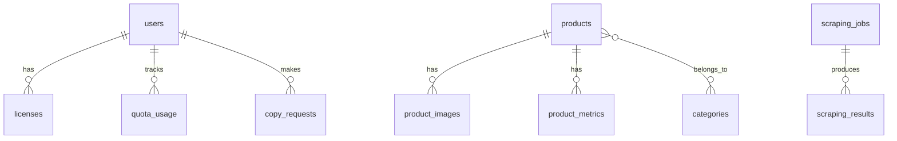

# 💾 Database Schema - TikTrend Finder

**Versão:** 1.0.0  
**Última Atualização:** 26 de Novembro de 2025

> [!IMPORTANT]
> **Mudança Arquitetural:** Versão 2.0 utiliza **PostgreSQL** (Cloud) + **SQLCipher** (Local) para balancear compartilhamento de dados e privacidade.

---

## 📋 Visão Geral

### PostgreSQL (Cloud - Compartilhado)
- Produtos coletados (shared cache)
- Métricas e analytics
- Licenças e usuários
- Jobs de scraping

### SQLCipher (Local - Privado)
- Listas de favoritos
- Histórico de copies
- Settings do usuário
- Cache de licença

---

## 🌐 PostgreSQL Schema

### ER Diagram



### Complete Schema

Ver [ARCHITECTURE.md](file:///home/jhonslife/Didin%20Facil/docs/ARCHITECTURE.md#-banco-de-dados) para detalhes completos do schema PostgreSQL.

**Principais Tabelas:**
- `users` - Usuários registrados
- `licenses` - Licenças ativas/expiradas
- `quota_usage` - Controle de quotas
- `products` - Produtos compartilhados
- `product_metrics` - Time-series de métricas
- `scraping_jobs` - Fila de scraping
- `copy_requests` - Histórico de geração IA

---

## 🔒 SQLCipher Schema (Local)

### Tabelas Principais

```sql
-- ==========================================
-- FAVORITE LISTS
-- ==========================================

CREATE TABLE favorite_lists (
    id TEXT PRIMARY KEY,
    name TEXT NOT NULL CHECK (length(name) > 0),
    description TEXT,
    color TEXT DEFAULT '#3b82f6',
    icon TEXT DEFAULT 'star',
    created_at TEXT DEFAULT (datetime('now')),
    updated_at TEXT DEFAULT (datetime('now'))
);

-- ==========================================
-- FAVORITE ITEMS
-- ==========================================

CREATE TABLE favorite_items (
    id TEXT PRIMARY KEY,
    list_id TEXT NOT NULL REFERENCES favorite_lists(id) ON DELETE CASCADE,
    product_id TEXT NOT NULL,  -- UUID from backend
    notes TEXT,
    tags TEXT,
    added_at TEXT DEFAULT (datetime('now')),
    UNIQUE(list_id, product_id)
);

CREATE INDEX idx_fitems_list ON favorite_items(list_id);

-- ==========================================
-- COPY HISTORY (Cached locally)
-- ==========================================

CREATE TABLE copy_history (
    id TEXT PRIMARY KEY,
    product_id TEXT,
    copy_type TEXT NOT NULL,
    tone TEXT NOT NULL,
    content TEXT NOT NULL CHECK (length(content) > 0),
    created_at TEXT DEFAULT (datetime('now')),
    is_favorite BOOLEAN DEFAULT 0
);

CREATE INDEX idx_copy_created ON copy_history(created_at DESC);

-- ==========================================
-- USER SETTINGS
-- ==========================================

CREATE TABLE user_settings (
    key TEXT PRIMARY KEY,
    value TEXT NOT NULL,
    updated_at TEXT DEFAULT (datetime('now'))
);

INSERT INTO user_settings (key, value) VALUES
    ('theme', 'dark'),
    ('language', 'pt-BR'),
    ('notifications_enabled', 'true');

-- ==========================================
-- LICENSE CACHE
-- ==========================================

CREATE TABLE license_cache (
    id INTEGER PRIMARY KEY CHECK (id = 1),
    jwt TEXT NOT NULL,
    expires_at TEXT NOT NULL,
    plan TEXT NOT NULL CHECK (plan IN ('basic', 'pro', 'enterprise')),
    user_email TEXT NOT NULL,
    hardware_id TEXT NOT NULL,
    quota_copy_used INTEGER DEFAULT 0,
    quota_copy_limit INTEGER DEFAULT 50,
    checked_at TEXT DEFAULT (datetime('now'))
);

-- ==========================================
-- SEARCH HISTORY
-- ==========================================

CREATE TABLE search_history (
    id TEXT PRIMARY KEY,
    query TEXT,
    filters_json TEXT,
    results_count INTEGER,
    searched_at TEXT DEFAULT (datetime('now'))
);

CREATE INDEX idx_search_date ON search_history(searched_at DESC);

CREATE TRIGGER limit_search_history
AFTER INSERT ON search_history
BEGIN
    DELETE FROM search_history
    WHERE id NOT IN (
        SELECT id FROM search_history
        ORDER BY searched_at DESC
        LIMIT 100
    );
END;
```

---

## 🔧 Queries Comuns

### PostgreSQL (Backend)

```sql
-- Top trending products (last 7 days)
SELECT 
    p.id,
    p.title,
    p.price,
    SUM(pm.sales_count) as total_sales
FROM products p
JOIN product_metrics pm ON pm.product_id = p.id
WHERE pm.date >= CURRENT_DATE - INTERVAL '7 days'
GROUP BY p.id
ORDER BY total_sales DESC
LIMIT 50;

-- Check user quota
SELECT 
    quota_type,
    limit_value - used as remaining
FROM quota_usage
WHERE user_id = $1
  AND period_start <= CURRENT_DATE
  AND period_end >= CURRENT_DATE;
```

### SQLCipher (Desktop)

```sql
-- List favorites with count
SELECT 
    fl.name,
    COUNT(fi.id) as count,
    fl.color
FROM favorite_lists fl
LEFT JOIN favorite_items fi ON fi.list_id = fl.id
GROUP BY fl.id;

-- Recent copies
SELECT 
    copy_type,
    substr(content, 1, 100) as preview,
    created_at
FROM copy_history
ORDER BY created_at DESC
LIMIT 20;

-- Check license validity
SELECT 
    datetime(expires_at) > datetime('now') as is_valid,
    plan,
    quota_copy_used,
    quota_copy_limit
FROM license_cache
WHERE id = 1;
```

---

## 📚 Documentos Relacionados

- [ARCHITECTURE.md](./ARCHITECTURE.md)
- [API-REFERENCE.md](./API-REFERENCE.md)
- [SECURITY.md](./SECURITY.md)

---

**Documento atualizado em 26/11/2025**
