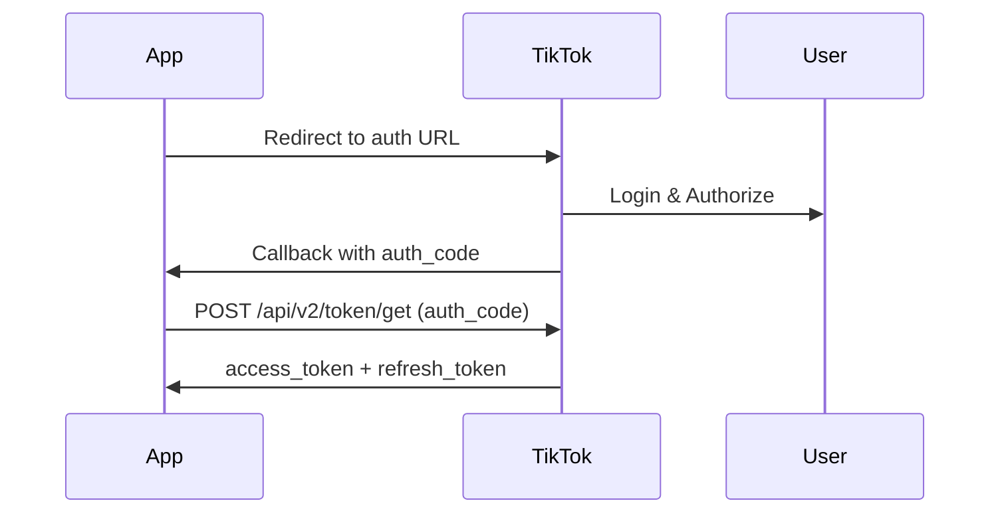

# Análise do TikTok Shop API SDK

> **Status:** Em avaliação (aguardando aprovação do app)
> **Data:** 2 de dezembro de 2025

## 📦 SDK Node.js Baixado

**Localização:** `~/Downloads/nodejs_sdk/`

### Estrutura do SDK

```
nodejs_sdk/
├── api/                    # APIs disponíveis (40+ versões)
├── client/                 # Cliente e configuração
│   ├── client.ts          # TikTokShopNodeApiClient
│   ├── config.ts          # ClientConfiguration (app_key, app_secret)
│   ├── token.ts           # AccessToken, refresh, getAccessToken
│   └── create-api-instance.ts
├── model/                  # Modelos de dados (typed)
│   ├── authorization/
│   ├── product/           # 14 versões (V202309 até V202509)
│   ├── order/
│   ├── promotion/
│   ├── seller/
│   └── ...
├── utils/
│   └── signGenerator.ts   # HMAC-SHA256 signing
└── README.md
```

## 🔌 APIs Disponíveis

### APIs de Produto (Principal para TikTrend Finder)

| API | Versão | Funcionalidades |
|-----|--------|-----------------|
| `ProductV202502Api` | Mais usada | `ProductsSearchPost` - Busca produtos |
| `ProductV202509Api` | Mais recente | Edit/PartialEdit products |
| `ProductV202309Api` | Legado (191KB) | CRUD completo de produtos |

### Outras APIs Úteis

| API | Funcionalidade |
|-----|----------------|
| `SellerV202309Api` | GetActiveShops, GetSellerPermissions |
| `PromotionV202309/V202406Api` | Cupons e promoções |
| `OrderV202309/V202507Api` | Gestão de pedidos |
| `AuthorizationV202312Api` | Widget tokens |

## 📊 Estrutura de Dados de Produto

### SearchProductsResponse

```typescript
interface Product {
  id: string;                    // ID TikTok Shop
  title: string;                 // Título do produto
  status: ProductStatus;         // DRAFT | PENDING | ACTIVATE | etc.
  salesRegions: string[];        // ["BR", "US", "MX", ...]
  createTime: number;            // Unix timestamp
  updateTime: number;
  skus: SKU[];                   // Variações
  recommendedCategories: Category[];
  listingQualityTier: "POOR" | "FAIR" | "GOOD";  // Só US
}

interface SKU {
  id: string;
  sellerSku: string;
  price: {
    currency: "BRL" | "USD" | "EUR" | ...;
    salePrice: string;           // Preço de venda
    taxExclusivePrice: string;   // Preço sem impostos
  };
  listPrice: ListPrice;          // Preço original (MSRP)
  inventory: Inventory[];
  fees: Fee[];                   // Taxas por categoria
}
```

## 🔐 Autenticação

### Fluxo OAuth 2.0



### Token Management (`token.ts`)

```typescript
// Obter token inicial
const response = await AccessTokenTool.getAccessToken(
  auth_code,
  app_key,
  app_secret
);

// Resposta
{
  access_token: string;
  access_token_expire_in: number;  // 7 dias
  refresh_token: string;
  refresh_token_expire_in: number;
  open_id: string;
  seller_name: string;
  seller_base_region: string;  // "BR"
  user_type: 0 | 1;  // 0=Seller, 1=Creator
}

// Renovar token
await AccessTokenTool.refreshToken(refresh_token, app_key, app_secret);
```

### Assinatura HMAC (`signGenerator.ts`)

```typescript
// O SDK já implementa assinatura automática
// Fórmula: HMAC-SHA256(app_secret + path + sortedParams + body + app_secret)
```

## 🚀 Como Usar o SDK

### 1. Instalação no Projeto

```bash
# Copiar SDK para o projeto
cp -r ~/Downloads/nodejs_sdk ./src/lib/tiktok-shop-sdk

# Instalar dependências
npm install request @types/request tslib
```

### 2. Configuração

```typescript
import { ClientConfiguration, TikTokShopNodeApiClient, AccessTokenTool } from "./lib/tiktok-shop-sdk";

// Configuração global
ClientConfiguration.globalConfig.app_key = process.env.TIKTOK_SHOP_APP_KEY;
ClientConfiguration.globalConfig.app_secret = process.env.TIKTOK_SHOP_APP_SECRET;

// Cliente
const client = new TikTokShopNodeApiClient({
  config: { sandbox: false }
});
```

### 3. Buscar Produtos

```typescript
const searchProducts = async (accessToken: string) => {
  const result = await client.api.ProductV202502Api.ProductsSearchPost(
    20,                    // pageSize (1-100)
    accessToken,          // x-tts-access-token
    'application/json',   // Content-Type
    undefined,            // pageToken (paginação)
    undefined,            // shopCipher (multi-shop)
    {                     // SearchProductsRequestBody
      // filtros opcionais
    }
  );
  
  return result.body.data.products;
};
```

## ⚠️ Limitações Atuais

### 1. Requer Autorização Seller OAuth
- Todas as APIs de produto requerem `access_token` de seller
- Não há API pública para buscar produtos de qualquer loja

### 2. Restrição Regional
- App precisa estar configurado para a região do seller
- Erro atual: "Não disponível na região da sua loja"
- **Solução:** Criar/editar app no Partner Center para região Brasil

### 3. Affiliate APIs Não Incluídas
- SDK baixado não inclui as novas Affiliate APIs
- Affiliate APIs permitiriam:
  - Buscar produtos com Open Collaboration
  - Buscar por categoria, comissão, keywords
  - Gerar links de afiliado
  - Rastrear conversões

## 📋 Próximos Passos (Quando Aprovado)

### Fase 1: Configuração Regional
1. Acessar TikTok Shop Partner Center
2. Editar app "TikTrend" → Target Market: Brazil
3. Ou criar novo app específico para Brasil

### Fase 2: Integração Básica
1. Copiar SDK para `/src/lib/tiktok-shop-sdk/`
2. Criar service layer em `/backend/integrations/tiktok_shop_sdk.py`
3. Implementar token management com Redis
4. Testar SearchProducts com token válido

### Fase 3: Affiliate APIs (Opcional)
1. Baixar SDK atualizado com Affiliate APIs
2. Ou implementar endpoints manualmente:
   - `POST /affiliate/202410/products/search`
   - `POST /affiliate/202410/open_collaborations`
3. Não requer OAuth de seller (usa credenciais de creator/affiliate)

## 🔗 Links Úteis

- [Partner Center](https://partner.tiktokshop.com)
- [Documentação API](https://partner.tiktokshop.com/docv2)
- [Affiliate APIs Blog](https://developers.tiktok.com/blog/2024-tiktok-shop-affiliate-apis-launch-developer-opportunity)
- [API Testing Tool](https://partner.tiktokshop.com/docv2/page/api-testing-tool)

## 📝 Comparação: SDK Node vs Scraper Atual

| Aspecto | SDK Oficial | Scraper Atual |
|---------|-------------|---------------|
| **Dados** | Produtos do seller autenticado | Qualquer produto público |
| **Preços** | Reais, atualizados | Estimados do HTML |
| **Rate Limits** | Definidos por API | Risco de bloqueio |
| **Legalidade** | 100% permitido | Zona cinza (ToS) |
| **Requisito** | OAuth + App aprovado | Apenas cookies |
| **Escopo** | Sua loja apenas | Qualquer loja |

## 💡 Recomendação

Para o **TikTrend Finder** (comparação de preços), a melhor abordagem seria:

1. **Curto prazo:** Continuar com scraper para dados públicos
2. **Médio prazo:** Integrar Affiliate APIs quando aprovado
   - Permite buscar produtos de qualquer loja com Open Collaboration
   - Legal e dentro dos ToS
3. **Longo prazo:** Parceria oficial como marketplace comparador
