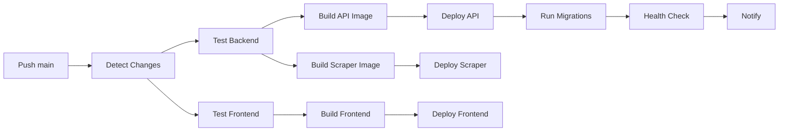

# 🏗️ AWS Infrastructure - TikTrend Finder

Infraestrutura como código (IaC) usando Terraform para deploy completo do TikTrend Finder na AWS.

## 📋 Arquitetura

```
                                    ┌─────────────────────────────────────────────────────────────┐
                                    │                         AWS Cloud                            │
                                    │                        us-east-2                             │
┌──────────────┐                    │  ┌─────────────────────────────────────────────────────────┐ │
│   Usuário    │                    │  │                    Public Subnets                       │ │
│   Browser    │────────────────────┼─▶│  ┌─────────────┐                    ┌────────────────┐  │ │
└──────────────┘                    │  │  │     ALB     │────────────────────│    NAT GW      │  │ │
       │                            │  │  └──────┬──────┘                    └────────────────┘  │ │
       │                            │  └─────────┼───────────────────────────────────────────────┘ │
       │                            │            │                                                  │
       │                            │  ┌─────────▼───────────────────────────────────────────────┐ │
       │                            │  │                   Private Subnets                       │ │
       │                            │  │  ┌─────────────────────────────────────────────────────┐│ │
       │                            │  │  │              ECS Fargate Cluster                    ││ │
       │ HTTPS                      │  │  │  ┌─────────────────┐  ┌─────────────────────────┐  ││ │
       │                            │  │  │  │   API Service   │  │    Scraper Service      │  ││ │
       │                            │  │  │  │   (FastAPI)     │  │    (Playwright)         │  ││ │
       │                            │  │  │  └────────┬────────┘  └──────────┬──────────────┘  ││ │
       │                            │  │  └───────────┼───────────────────────┼────────────────┘│ │
       │                            │  └──────────────┼───────────────────────┼─────────────────┘ │
       │                            │                 │                       │                    │
       │                            │  ┌──────────────┼───────────────────────┼─────────────────┐ │
       │                            │  │              │   Database Subnets    │                 │ │
       │                            │  │  ┌───────────▼──────┐  ┌─────────────▼───────────────┐ │ │
       │                            │  │  │  RDS PostgreSQL  │  │      ElastiCache Redis     │ │ │
       │                            │  │  │     (15.4)       │  │           (7)              │ │ │
       │                            │  │  └──────────────────┘  └─────────────────────────────┘ │ │
       │                            │  └────────────────────────────────────────────────────────┘ │
       │                            └─────────────────────────────────────────────────────────────┘
       │
       │                            ┌─────────────────────────────────────────────────────────────┐
       │                            │                      CloudFront CDN                         │
       │                            │  ┌─────────────────────────────────────────────────────────┐│
       └───────────────────────────▶│  │              S3 (Frontend SPA)                         ││
                                    │  │              React + Vite Build                         ││
                                    │  └─────────────────────────────────────────────────────────┘│
                                    └─────────────────────────────────────────────────────────────┘
```

## 🚀 Quick Start

### Pré-requisitos

- [Terraform](https://terraform.io) >= 1.5.0
- [AWS CLI](https://aws.amazon.com/cli/) configurado
- Conta AWS com permissões administrativas
- Domínio registrado (para certificados SSL)

### 1. Clone e configure

```bash
cd infra/aws

# Copie o arquivo de exemplo
cp production.tfvars.example terraform.tfvars

# Edite com seus valores
nano terraform.tfvars
```

### 2. Inicialize o Terraform

```bash
# Inicializar providers
terraform init

# Validar configuração
terraform validate

# Ver plano de execução
terraform plan -var-file="terraform.tfvars"
```

### 3. Deploy da infraestrutura

```bash
# Aplicar (digite 'yes' para confirmar)
terraform apply -var-file="terraform.tfvars"
```

### 4. Configurar DNS

Após o deploy, configure os registros DNS no seu provedor:

1. Pegue os nameservers do Route53
2. Configure no seu registrador de domínio

### 5. Deploy da aplicação

O GitHub Actions fará o deploy automaticamente ao push para `main`, ou:

```bash
# Manual trigger
gh workflow run deploy-aws.yml
```

## 📁 Estrutura de Arquivos

```
infra/aws/
├── main.tf                 # VPC, Security Groups, Provider
├── variables.tf            # Todas as variáveis configuráveis
├── database.tf             # RDS PostgreSQL + ElastiCache Redis
├── ecs.tf                  # ECS Cluster, ECR, Task Definitions
├── alb.tf                  # Application Load Balancer + SSL
├── s3-cloudfront.tf        # S3 Buckets + CloudFront CDN
├── secrets.tf              # Secrets Manager + SSM
├── monitoring.tf           # Auto-scaling + CloudWatch + Alerts
├── outputs.tf              # Outputs úteis
├── production.tfvars.example # Exemplo de variáveis
└── README.md               # Esta documentação
```

## 🔧 Componentes

### VPC
- 3 AZs para alta disponibilidade
- Subnets públicas, privadas e de banco de dados
- NAT Gateway para acesso à internet
- VPC Flow Logs para auditoria

### ECS Fargate
- Cluster serverless (sem EC2 para gerenciar)
- Auto-scaling baseado em CPU/memória
- Health checks com circuit breaker
- Logs centralizados no CloudWatch

### RDS PostgreSQL
- PostgreSQL 15.4
- Storage SSD gp3 com IOPS provisionados
- Backup automático (7 dias)
- Criptografia at-rest

### ElastiCache Redis
- Redis 7 para cache e sessões
- Eviction policy: allkeys-lru
- Cluster mode disponível (futuro)

### CloudFront + S3
- CDN global para frontend
- Caching otimizado para SPA
- HTTPS com certificado ACM
- Origin Access Control (OAC)

### Monitoramento
- CloudWatch Alarms
- SNS para notificações
- Dashboard customizado
- Métricas de aplicação

## 💰 Estimativa de Custos

| Recurso | Tipo | Custo Estimado/mês |
|---------|------|-------------------|
| ECS Fargate (API) | 0.5 vCPU, 1GB | ~$15-30 |
| ECS Fargate (Scraper) | 1 vCPU, 2GB | ~$30-50 |
| RDS PostgreSQL | db.t3.medium | ~$50-60 |
| ElastiCache Redis | cache.t3.medium | ~$40-50 |
| ALB | - | ~$20-25 |
| CloudFront | 100GB transfer | ~$10-15 |
| NAT Gateway | - | ~$35-40 |
| S3 | 10GB storage | ~$1-2 |
| Route53 | 1 hosted zone | ~$0.50 |
| **Total estimado** | | **~$200-275/mês** |

> ⚠️ Custos podem variar significativamente com tráfego e uso.

## 🔒 Segurança

### Práticas Implementadas
- ✅ VPC com subnets isoladas
- ✅ Security Groups restritivos
- ✅ Secrets no AWS Secrets Manager
- ✅ Criptografia at-rest (RDS, S3)
- ✅ HTTPS obrigatório (TLS 1.3)
- ✅ IAM roles com least privilege
- ✅ Logs de auditoria (VPC Flow Logs)

### Secrets do GitHub Actions

Configure estes secrets no repositório:

| Secret | Descrição |
|--------|-----------|
| `AWS_ACCESS_KEY_ID` | IAM Access Key |
| `AWS_SECRET_ACCESS_KEY` | IAM Secret Key |
| `AWS_ACCOUNT_ID` | ID da conta AWS |
| `CLOUDFRONT_DISTRIBUTION_ID` | ID da distribuição CloudFront |
| `PRIVATE_SUBNET_IDS` | IDs das subnets privadas (separados por vírgula) |
| `ECS_SECURITY_GROUP_ID` | ID do security group ECS |
| `VITE_API_URL` | URL da API para o frontend |
| `MERCADOPAGO_PUBLIC_KEY` | Chave pública do MercadoPago |
| `SLACK_WEBHOOK_URL` | (Opcional) Webhook do Slack |

## 📊 Comandos Úteis

### Terraform

```bash
# Ver estado atual
terraform show

# Ver outputs
terraform output

# Destruir tudo (CUIDADO!)
terraform destroy -var-file="terraform.tfvars"

# Atualizar módulos
terraform get -update
```

### AWS CLI

```bash
# Listar serviços ECS
aws ecs list-services --cluster tiktrend-production

# Ver logs do API
aws logs tail /ecs/tiktrend-api --follow

# Forçar novo deploy
aws ecs update-service --cluster tiktrend-production --service tiktrend-api --force-new-deployment

# Invalidar cache CloudFront
aws cloudfront create-invalidation --distribution-id XXXXX --paths "/*"
```

### Docker/ECR

```bash
# Login no ECR
aws ecr get-login-password --region us-east-2 | docker login --username AWS --password-stdin $AWS_ACCOUNT_ID.dkr.ecr.us-east-2.amazonaws.com

# Build e push manual
docker build -f docker/api.Dockerfile -t tiktrend-api .
docker tag tiktrend-api:latest $ECR_URL/tiktrend-api:latest
docker push $ECR_URL/tiktrend-api:latest
```

## 🔄 CI/CD Pipeline

O workflow `.github/workflows/deploy-aws.yml` executa:

1. **Detect Changes** - Identifica o que mudou
2. **Test** - Roda testes (backend + frontend)
3. **Build** - Cria imagens Docker e build do frontend
4. **Deploy** - Atualiza ECS e S3
5. **Migrate** - Executa migrações do banco
6. **Health Check** - Verifica se está funcionando
7. **Notify** - Envia notificação (Slack)



## 🐛 Troubleshooting

### ECS Task não inicia

```bash
# Ver eventos do serviço
aws ecs describe-services --cluster tiktrend-production --services tiktrend-api

# Ver logs do task
aws ecs describe-tasks --cluster tiktrend-production --tasks TASK_ARN
```

### RDS conexão recusada

1. Verifique Security Group
2. Verifique se a subnet do ECS tem acesso à subnet do RDS
3. Verifique credenciais no Secrets Manager

### CloudFront 403

1. Verifique OAC configuration
2. Verifique bucket policy
3. Rode `terraform apply` novamente

### Migrations falham

```bash
# Conectar ao RDS diretamente (via bastion/VPN)
psql $DATABASE_URL

# Ver histórico de migrations
alembic history
alembic current
```

## 📚 Recursos Adicionais

- [Terraform AWS Provider](https://registry.terraform.io/providers/hashicorp/aws/latest)
- [AWS ECS Best Practices](https://docs.aws.amazon.com/AmazonECS/latest/bestpracticesguide)
- [FastAPI Deployment](https://fastapi.tiangolo.com/deployment/)

---

**Última atualização:** Janeiro 2025  
**Versão do Terraform:** >= 1.5.0  
**Região AWS:** us-east-2 (Ohio)
